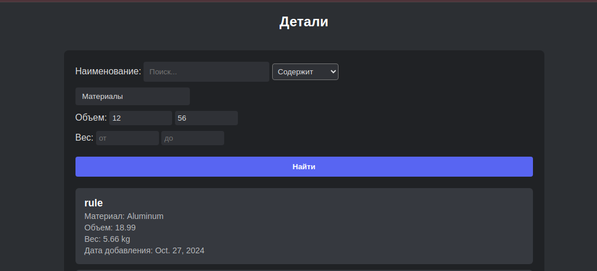

## Стек
1. Python
2. Django
3. Poetry

Приложение с поиском деталей по разлчным параметрам.

## Запуск
Убедитесь что у вас установлены Python и Poetry, после чего необходимо перейти в корневую папку проекта и выполнить команды:
```bash
poetry install
poetry run python manage.py runserver
```

Запуститься программа по следующему url: http://127.0.0.1:8000/

# Интерфейс


На картнке показан интерфейс программы. Пользователю доступен поиск по различным параметрам:
1. По выражению которое содержиться в названии
2. По Выражению с которого начинается название
3. По типу материала
4. По весу в указанных границах
5. По объему в указанных границах